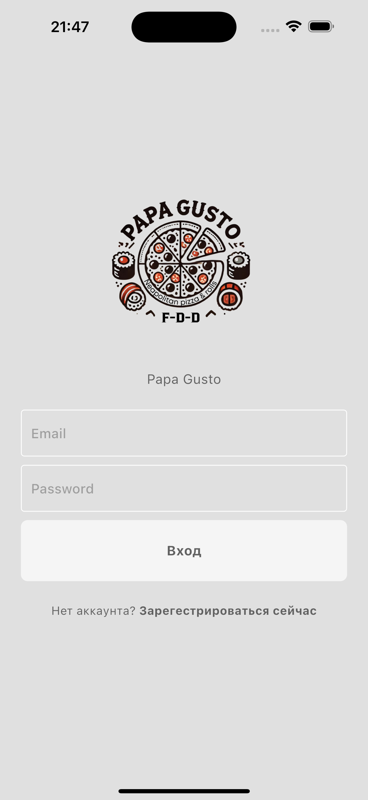
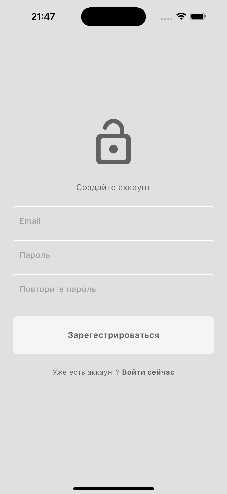
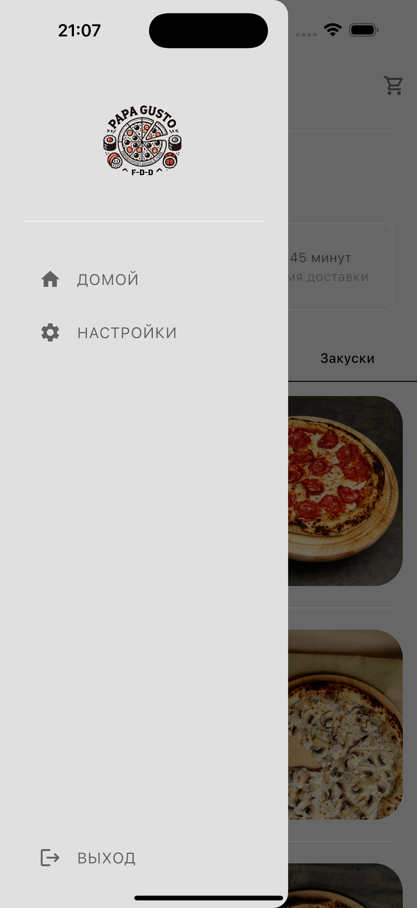
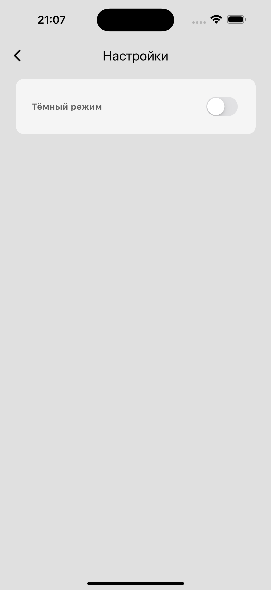
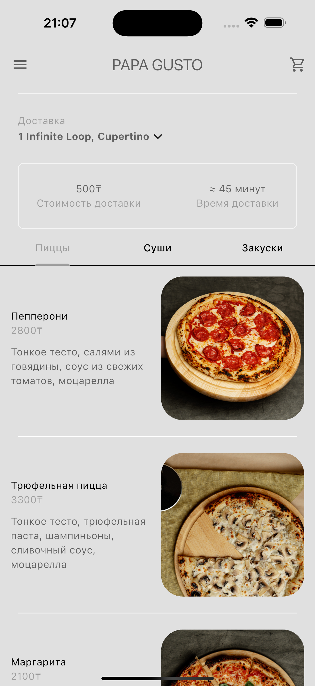
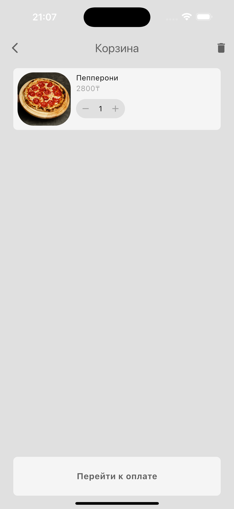
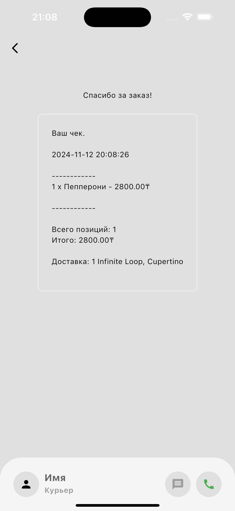

# papa_gusto_app

Commercial application for a pizzeria named Papa Gusto (not yet completed)

**About project:** Commercial application for a pizzeria named Papa Gusto, connected to a Firestore database and a Telegram bot for sending notifications to the cook, with payment integration via Kaspi.kz and delivery functionality.

**RUN GUIDE:** 

* download project
* open with any SDK
* run

**SCREENSHOTS:** 

